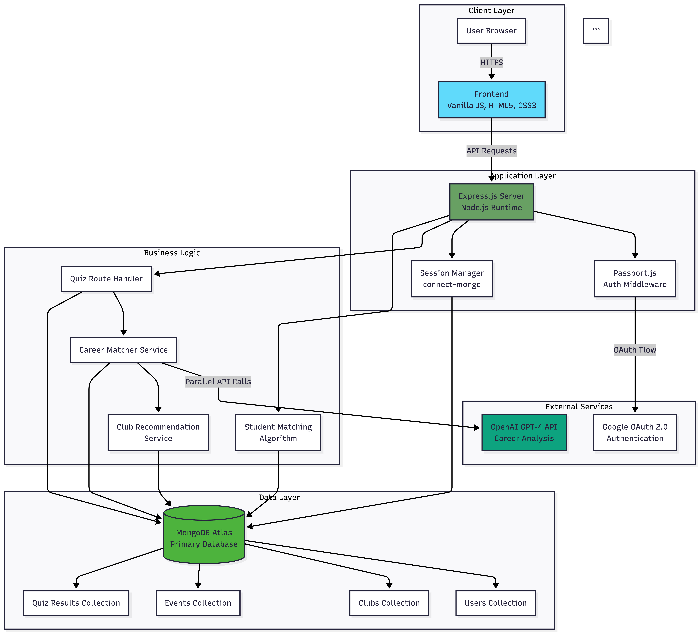
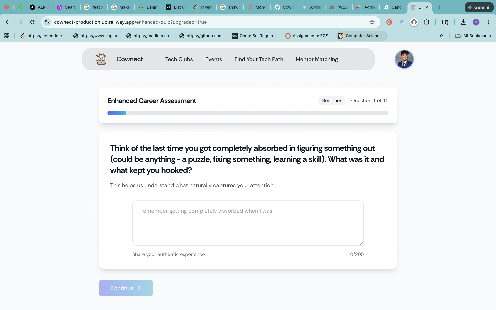
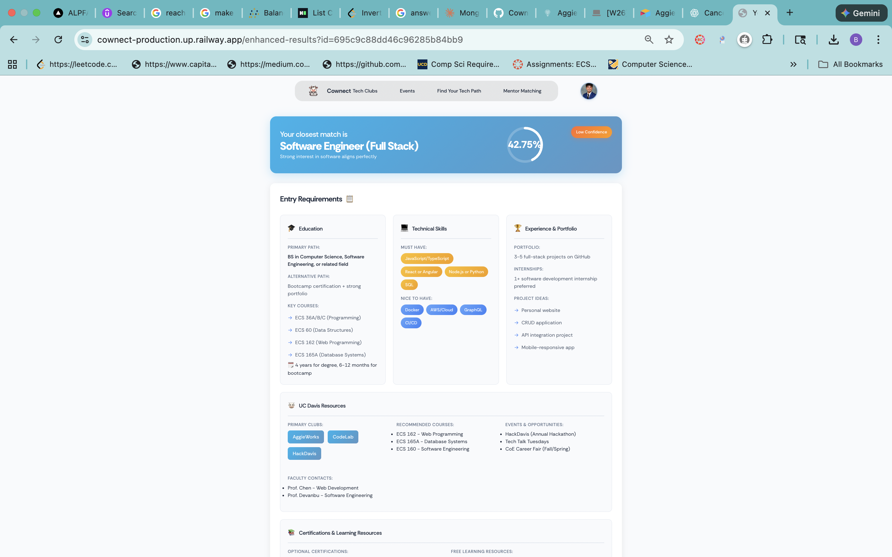
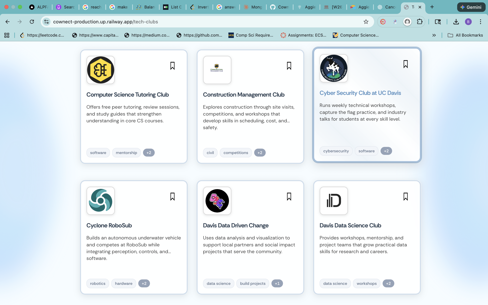

<div align="center">

# Cownect

AI-powered career discovery for UC Davis students

[](https://www.cownect.org/)


[Live Demo](https://www.cownect.org/) • [Report Bug](https://github.com/brianescutia/Cownect/issues)

</div>

---

## What is Cownect?

Full-stack platform helping UC Davis students discover tech careers using AI and connect with campus organizations.

- 🎓 350+ active students  
- 📊 1,000+ career assessments completed  
- ✨ Recognized by UC Davis CS Department

---

## Demo Video

[](YOUR-VIDEO-URL-HERE)

---

## Features

🤖 AI career analysis across 70+ tech paths  
🎯 Smart club recommendations from 70+ UC Davis orgs  
👥 Student matching for study partners  
📅 Campus tech event discovery

---

## Architecture



**Tech Stack:** Node.js, Express, MongoDB, OpenAI GPT-4, Passport.js

**Key Optimizations:**
- Parallel OpenAI API calls with `Promise.all()`
- MongoDB compound indexes for fast queries
- Session-based auth with Google OAuth

---

## Quick Start
```bash
git clone https://github.com/brianescutia/Cownect.git
cd Cownect
npm install
cp .env.example .env  # Add your MONGO_URI, OPENAI_API_KEY
node backend/seedClubs.js
npm run dev
```

Visit `http://localhost:3000`

---

## Environment Variables
```bash
MONGO_URI=your-mongodb-uri
OPENAI_API_KEY=your-openai-key
SESSION_SECRET=random-secret-32-chars
PORT=3000
```

See `.env.example` for full template.

---

## Project Structure
```
backend/
  ├── models/       # User, Club, Event schemas
  ├── services/     # AI matching, recommendations
  └── app.js        # Express server

frontend/
  ├── pages/        # HTML views
  ├── scripts/      # Client JS
  └── styles/       # CSS
```

---

## Screenshots

<details>
<summary>View Screenshots</summary>





</details>

---

## Team

**Built by:** Brian Escutia (Lead), Yash (Backend), Luke (Frontend), Eric (UX), Corbin (Advisor)

**My Contributions:**  
System architecture • AI integration • Student matching algorithm • Deployment

---

## Contact

**Brian Escutia**  
📧 bescutia@ucdavis.edu  
💼 [LinkedIn](https://linkedin.com/in/brianescutia)  
🌐 [Live Demo](https://your-live-url.com)

---

<div align="center">

MIT © 2024 Brian Escutia

Made with ❤️ at UC Davis

</div>
